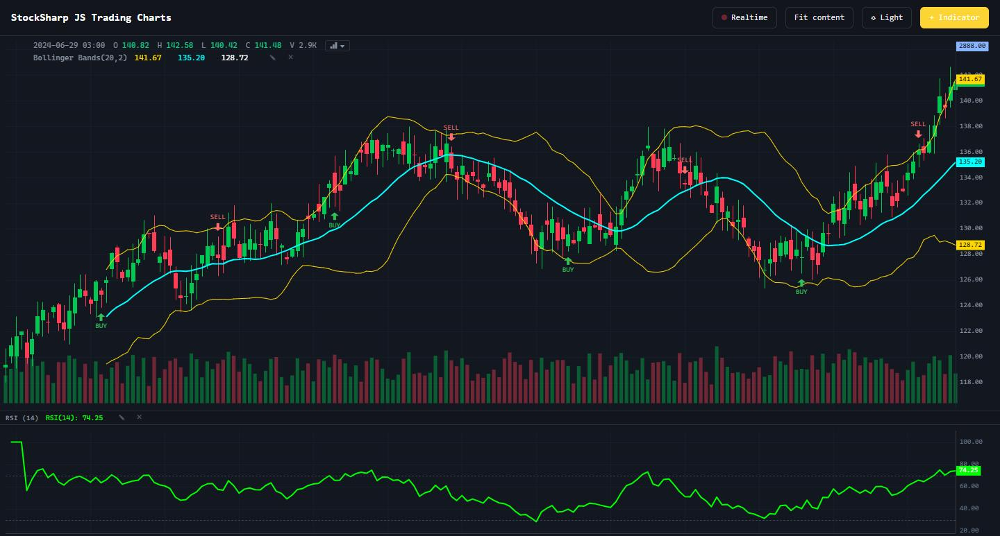

# StockSharp JS Trading Charts

In-house, dependency-free canvas trading-chart engine (**sschart**) plus the full
StockSharp web-terminal chart stack, packaged as a standalone library with a
self-contained demo.



`sschart` renders candlestick / OHLC, study and footprint charts on a plain
`<canvas>` through a small declarative API (`createChart`, `addSeries`,
`setData` / `update`, `timeScale`, series markers, price lines, crosshair),
published as the `SSChart` global.

**▶ Live demo: https://stocksharp.github.io/Charts/demo/**

## What's here

```
src/sschart.ts        the chart engine (single file, no runtime deps)
src/chart/            the terminal chart stack, ported verbatim from Broker.Web.Trader:
  indicators/         IndicatorEngine + IndicatorRenderer + IndicatorSettings +
                      calc/ (≈160 indicator implementations)
  chart-legend.ts     OHLCV + indicator-value legend (crosshair-driven)
  chart-context-menu.ts   right-click menu
  chart-pane-manager.ts   oscillator sub-panes (spine-synced time axes)
  indicator-dialog.ts     indicator picker (search / categories / params / active list)
  chart-type-switcher.ts  candle / bar / line / area / heikin / renko / P&F / cluster / box
  i18n.ts, utils.ts   minimal shims (English fallback, formatPrice + showToast)
  app.ts              demo wiring — drives the modules exactly as terminal-app.ts does
demo/                 the showcase (index.html + terminal CSS + seeded market data)
build.mjs             esbuild -> dist/sschart.js (SSChart global) + dist/chart-app.js
```

The chart modules are the **same code the web terminal runs** — they were lifted
out and decoupled from the terminal's Bootstrap / DI infrastructure so they build
standalone. The engine (`src/sschart.ts`) is the shared source of truth; the demo
loads it as the `SSChart` global, then the chart-stack bundle on top.

## Demo

`demo/index.html` is a live trading chart driven by the real modules:

- **Main chart** — candlestick with volume, trade markers and a crosshair legend;
  the chart-type dropdown switches the render between candlestick, bar, line, area,
  Heikin-Ashi, Renko, Point & Figure, cluster (footprint) and box.
- **Indicators** — a **+ Indicator** button / right-click *Add indicator…* opens the
  real picker over the full StockSharp indicator catalog; overlays draw on the main
  chart, oscillators (RSI, MACD, …) get their own spine-synced sub-pane with a proper
  0–100 scale; the legend shows each study's value at the crosshair. All recompute
  live on the streaming feed.
- **Light / dark** theme toggle re-colours the whole stack, and a play/pause
  **Realtime** feed streams new bars with live indicator recompute.

## Usage

Load the engine bundle (it publishes `window.SSChart`) and drive it with a small
declarative API — `time` is UNIX **seconds**:

```html
<div id="chart" style="width:800px;height:400px"></div>
<script src="dist/sschart.js"></script>
<script>
  const chart = SSChart.createChart(document.getElementById('chart'), {
    layout: { background: { type: 'solid', color: '#131820' }, textColor: '#8b97a7' },
    grid:   { vertLines: { color: '#1e2633' }, horzLines: { color: '#1e2633' } },
    rightPriceScale: { borderColor: '#1e2633' },
    timeScale: { borderColor: '#1e2633', timeVisible: true },
    crosshair: { mode: SSChart.CrosshairMode.Normal },
  });

  // candlesticks
  const candles = chart.addSeries(SSChart.CandlestickSeries, {
    upColor: '#00c853', downColor: '#ff3d57', borderVisible: false,
  });
  candles.setData([
    { time: 1704153600, open: 120, high: 122, low: 119, close: 121 },
    { time: 1704240000, open: 121, high: 124, low: 120, close: 123 },
  ]);

  // an overlay line (e.g. a moving average) on the same pane
  const ma = chart.addSeries(SSChart.LineSeries, { color: '#f0b90b', lineWidth: 2 });
  ma.setData([{ time: 1704153600, value: 120.5 }, { time: 1704240000, value: 122.0 }]);

  // trade markers + a price line
  SSChart.createSeriesMarkers(candles, [
    { time: 1704240000, position: 'belowBar', color: '#00c853', shape: 'arrowUp', text: 'BUY' },
  ]);
  candles.createPriceLine({ price: 123, color: '#4a9eff', lineStyle: SSChart.LineStyle.Dashed, title: 'entry' });

  // realtime: same time replaces the last bar, a newer time appends a new one
  candles.update({ time: 1704326400, open: 123, high: 123.5, low: 122.8, close: 123.2 });

  chart.timeScale().fitContent();
</script>
```

Series types: `CandlestickSeries`, `BarSeries`, `LineSeries`, `AreaSeries`,
`HistogramSeries`, `RenkoSeries`, `PointFigureSeries`, `FootprintSeries`,
`ExactVolumeProfileSeries`, `ClusterSeries`, `BoxSeries2`. The legacy
`VolumeProfileSeries` is retained only as an unsupported migration marker and
does not distribute candle volume across price bins. In a TypeScript build you can instead
`import { createChart, CandlestickSeries } from './src/sschart'` and bundle it.

For the **full terminal experience** — indicator engine over the whole catalog,
crosshair legend, oscillator sub-panes, right-click menu and the picker dialog —
wire up the `src/chart` modules the way [`src/chart/app.ts`](src/chart/app.ts) does.

### Custom indicator painters

An indicator is drawn as one or more ordinary lines by default. To opt into a
special renderer, put a stable painter name in its `catalog.json` entry:

```json
{
  "kind": "MyIndicator",
  "name": "My indicator",
  "pane": "separate",
  "painter": "my-histogram"
}
```

Register a factory before adding that indicator. A fresh painter is created for
each indicator instance; `paint` creates and returns its series, while `update`
refreshes them on every live recalculation:

```js
SSChart.registerIndicatorPainter('my-histogram', () => ({
  paint(ctx) {
    const color = ctx.nextColor();
    const bars = ctx.addSeries('histogram', { color, title: 'My histogram' }, ctx.output('value'));
    return { series: [bars], colors: [color] };
  },
  update(ctx, series) {
    series[0].setData(ctx.output('value'));
  },
}));
```

TypeScript consumers can import the contract and registry from
`src/chart/indicators/painters/index.ts`. If a painter name is absent or is not
registered, the renderer safely falls back to normal lines.

### Exact order-flow data

Order flow uses an explicit `FootprintBar` contract. `bidVolume` is the volume of
aggressive sells executed against resting bids; `askVolume` is the volume of
aggressive buys executed against resting asks. Every level price and OHLC price
must align to the instrument tick size:

```ts
const bars = normalizeFootprintBars([{
  dataMode: OrderFlowDataMode.Exact,
  time: 1704240000,
  open: 100.00,
  high: 100.02,
  low: 99.99,
  close: 100.01,
  levels: [
    { price: 99.99, bidVolume: 18, askVolume: 0, tradeCount: 2 },
    { price: 100.00, bidVolume: 12, askVolume: 20, tradeCount: 5 },
    { price: 100.01, bidVolume: 4, askVolume: 31, tradeCount: 6 },
    { price: 100.02, bidVolume: 0, askVolume: 9, tradeCount: 1 },
  ],
}], { tickSize: 0.01 });
```

`ApproximateFootprintBar` is a separate discriminated type with only
`totalVolume` and a mandatory approximation reason. The library never invents a
bid/ask split or silently passes candle-volume distribution as exact footprint
data. Legacy `ClusterData`/`VolumeProfileData` remain explicitly deprecated
approximation contracts during compatibility migration.

Classified executions can be aggregated incrementally without rebuilding prior
bars. `FootprintAggregator.push(trade)` emits either a one-bar `update` patch for
the active interval or a one-bar `append` patch for the next interval. Bar
boundaries are aligned by `barDuration` and optional `timeOrigin`; OHLC and every
level are derived only from the supplied executions.

`calculateFootprintMetrics` is a pure calculation path for total bid/ask,
delta, POC, value area, diagonal/stacked imbalance, and auction completion. Buy
imbalance compares `ask(P)` to `bid(P - tick)`; sell imbalance compares `bid(P)`
to `ask(P + tick)`. Viewport zoom is deliberately absent from these options.

`FootprintSeries` is a regular `CustomSeriesDefinition`, so it is added with
`chart.addSeries(FootprintSeries, { tickSize, mode })` and does not add a branch
to the chart core. It supports `bid-ask`, `delta`, `total`, and `ladder` modes.
Automatic detail switches only the presentation between numbers, heatmap cells,
and an OHLC/delta summary; all three use the same cached metrics.

`calculateVolumeProfile` and `ExactVolumeProfileAccumulator` aggregate the exact
levels themselves, including POC and value area; candle volume is never spread
between low and high. The accumulator supports append and replace-last through
level deltas. `calculateDevelopingVolumeProfile` exposes cumulative POC/VAH/VAL.
For heterogeneous input, `resolveVolumeProfile` returns an explicit
`approximate` or `mixed` unavailable result instead of producing a profile.

`ExactVolumeProfileSeries` renders that calculation as a non-time-scale custom
overlay. Its range is explicitly `visible`, `fixed`, or `session`; session mode
uses serializable half-open session ranges rather than runtime callbacks. Fixed
and session profiles remain visible outside their source viewport, and optional
developing POC/VAH/VAL paths share the same selected exact bars.

`TpoSeries` is a separate Market Profile custom series. Its `TpoBar` input has
an explicit serializable `sessionId`; calculation produces per-session TPO
counts, letters, POC, value area, initial balance, and single prints. Automatic
zoom switches only between letters and compact blocks and never changes those
session calculations.

## Build & view

```
npm install        # once, to fetch esbuild
npm run build      # bundles src -> dist/
npm run serve      # http://localhost:8791/demo/index.html
npm test           # the ported indicator suite (163 files) against src/chart/indicators/calc
```

## Tests

The indicator unit tests (`tests/indicators/*.test.js`, ported from the web
terminal) run every `calc/` implementation and are the single source of truth for
indicator correctness. `build-tests.mjs` esbuild-bundles them into `tests/_dist`,
then `node --test` runs them.

## Notes

- Porting the stack surfaced and fixed a few latent engine bugs (chart-level
  `priceScale(id)`, whitespace/warm-up points poisoning the price-scale bounds,
  a fallback for ordinal sub-pane scales, `scrollToRealTime`). These live in
  `src/sschart.ts` here; folding them back into the terminal's copy is a follow-up.
